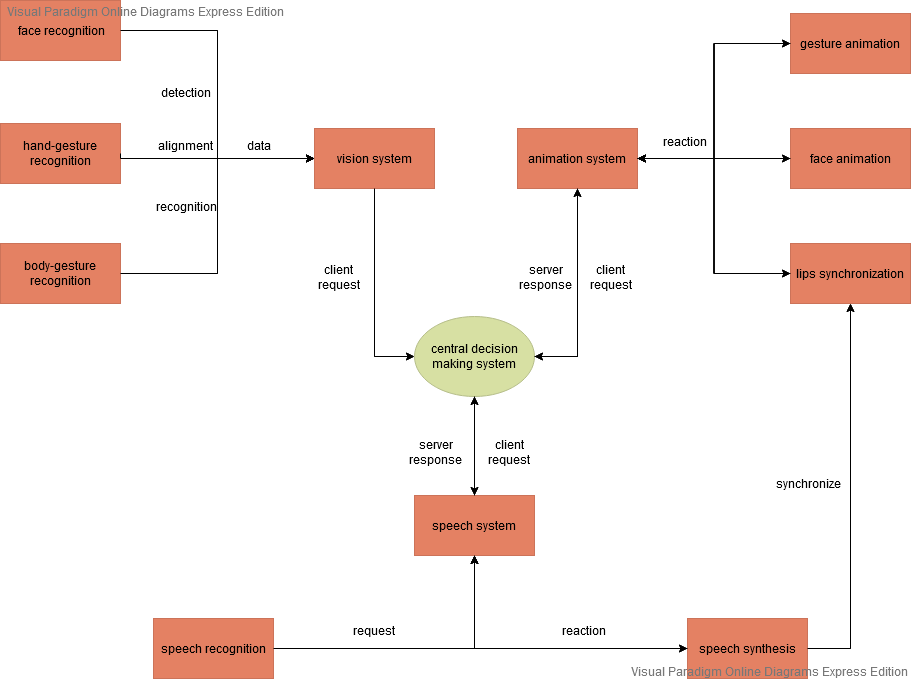
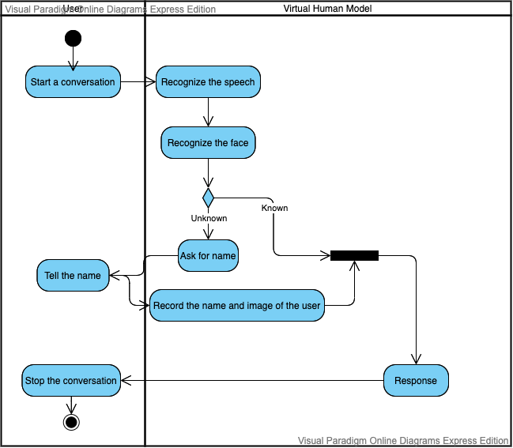

# constructing-virtual-human
- Constructed an intelligent virtual human using Unity3D, including the implementation of facial expressions, body movements, speech synthesis, and lip synchronization.
- Developed a central decision-making system that integrates other virtual human functions, such as facial, speech, hand and body gesture recognition.
- Implemented stable interaction between the virtual human and users, including calling a user by name and initiating conversations, playing the game of rock-paper-scissors, and engaging in basic conversation, resulting in a smooth and seamless experience.
## Requirement
### Requirement Elicitation
- Questionnaires

- Stakeholder analysis

         Professor, Student, Visitor, Dean

- Persona board (Make 2 or 3 that demonstrate key user types.)

| Persona                                 | Student                                                      | Visitor                                                      | Professor                                                    | Dean                                                         |
| :-------------------------------------- | ------------------------------------------------------------ | ------------------------------------------------------------ | ------------------------------------------------------------ | ------------------------------------------------------------ |
| Fictional Name                          | Wangsu Long                                                  | Alice Swift                                                  | James Johnson                                                | Hao Chen                                                     |
| Job/                                    | Sophomore in University                                      | Product manager                                              | Assistant professor in Computer Science Department           | Dean of FOSE Department                                      |
| Hometown                                | Hangzhou,China                                               | Chengdu, China                                               | Orlando, USA                                                 | Beijing, China                                               |
| Demographics                            | 1. 20 years old 2. Only child in family 3. Studying Computer Science | 1. 40 years old 2. Her son is  a junior student in UNNC 3. master in Economics | 1. 40 years old 2. married                         | 1. 55 years old 2. married 3, Enthusiastic about teaching and mentoring |
| Environment                             | He is a diligent student who loves computer science. He is currently studying hard for scholarship so he will stay at PMB building all day to study. He finds this kind of life styles is a little monolithic. It would be great if there is some entertainment in PMB building. | Alice is a single mother whose son is current studying at UNNC. She is really eager for school activities, especially Open Day. She likes to attend Open Day and see how school changed. | James is an assistant professor whose research interest is in Robotics and Computer Vision. He would like to give his students a challenging project which is quite related to his research interests. | Hao has been in tenure for more than five years. He is now looking for new products created/completed by students so that the FOSE Department have more things to show on school's magazine and to visitors. |
| Goal/Expectations for the Virtual Human | He expects the virtual human should be as interactive as possible. It would be better if it has some entertaining functionalities. | Since Alice is not familiar wit PMB building and school map, she expects the virtual human could show her the spatial and geographical information of school and PMB building so that she won't be lost. | James expects the virtual human should be able to recognize the on-campus student by  face and talk to users who stand in front of it. | Hao expects the virtual human to have a decent appearance and well-integrated functions so that it could used as a display. |

### Requirement Gathering
- ~~User story (“As a <role>, I want <goal/desire> so that <outcome>”)~~
### Requirement Documenting
- document
### Investigating / Validating Requirements
- Observator
### Requirement Modeling
- Context Diagrams (Show related systems, define the boundaries of they system)

    

    

- ~~Task Analyses (optional)~~

- Unified Modeling Language (UML)
	- ~~Use Case Diagrams~~
	- Activity Diagrams (involve decisions)
    
	- ~~Sequence Diagrams (used to specify function calls in Java objects)~~
	- ~~Class Diagrams (Shows levels of inheritance for classes in OO)~~
	- ~~State Diagrams~~
	
- Scenarios
    - define a setting or context.
    - define one or more actors or user
    - define goals or objectives
    - describe a plot.
    - describes how a user, in a context, achieves a goal
### Requirement validation
- Importance table
